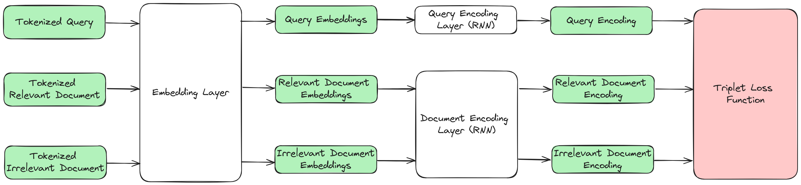

# TwoTowerSearch





## Local Setup

Create virtual environment:

```bash
python -m venv env
source env/bin/activate
```

Install dependencies (python 3.12):

```bash
pip install -r requirements.txt
``` 

Start the FastAPI server:

```bash
uvicorn app.main:app --reload
```

In a seperate terminal, start the streamlit app:

```bash
streamlit run streamlit_app.py
```


